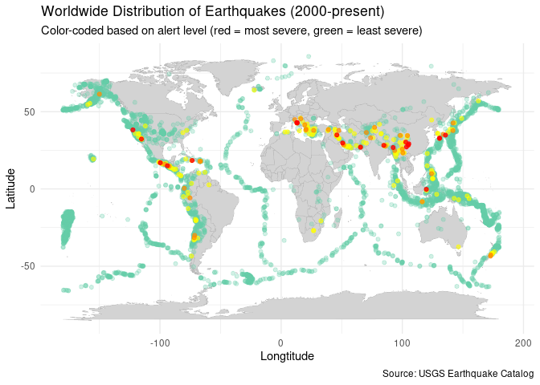
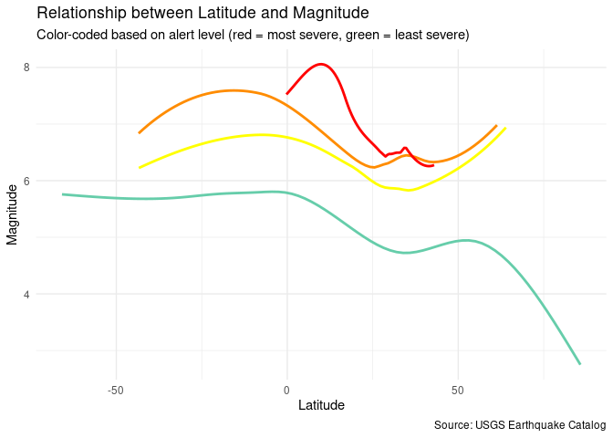
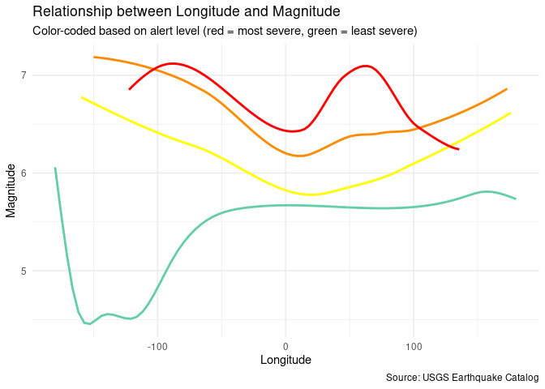
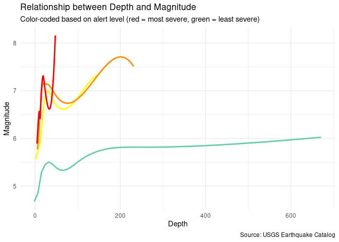

Part 2: More complicated data collection
================
Eva Wu

-   [Load the data](#load-the-data)
-   [Explore the data](#explore-the-data)
    -   [Distribution of earthquakes](#distribution-of-earthquakes)
    -   [Latitude and magnitude](#latitude-and-magnitude)
    -   [Longitude and magnitude](#longitude-and-magnitude)
    -   [Depth and Magnitude](#depth-and-magnitude)
-   [Session info](#session-info)

## Load the data

``` r
earthquake <- function(alert) {
  # send GET request
  response <- GET(
    url = "https://earthquake.usgs.gov/fdsnws/event/1/query?",  # provide base url
    query = list(
      format = "csv",
      starttime = "2000-01-01",  # focus on earthquakes after 2000
      endtime = "2021-11-30",
      eventtype = "earthquake",
      orderby = "magnitude",     # arrange by magnitude
      alertlevel = alert    # focus on earthquakes with red alert level
    )
  )
  # parse response to JSON
  response_df <- content(response) %>%
    as_tibble()
  return(response_df)
}

red <- earthquake("red")
orange <- earthquake("orange")
yellow <- earthquake("yellow")
green <- earthquake("green")
# I did it this way rather than using the combined data because I wanted to use my own selections of colors;
# also getting all the data takes too long and the server won't respond in forever b/c the file is too large
```

## Explore the data

### Distribution of earthquakes

<!-- -->

This map shows the distribution of earthquakes from 2000 to present.
From the plot we can see that there are many more earthquakes with green
alert level documented than those with yellow alert level, than those
with orange alert level, which is still more than those with red alert
level. The more severe the earthquake is, the less frequently it might
happen. Also, the green ones seem to cover a more widespread area, with
many of them occurring in the ocean, while the red ones seem to only
occur on or near the continent across the latitude of 0-50.

### Latitude and magnitude

<!-- -->

This graph shows the relationship between latitude and magnitude of
earthquakes. As seen in the graph, there is not a clear relationship
between these two variables, but there is a trend for earthquakes with
green alert level - the greater latitude, the smaller magnitude. We can
also tell from the graph that green-level earthquakes spread over a wide
range of latitude, while the red-level ones cover only a small range.

### Longitude and magnitude

<!-- -->

Again, this graph does not show a clear overall relationship between
longitude and magnitude. However, the green-level earthquakes have a
sharp decrease in magnitude between the longitude of -200 and -150, and
then there is a slow increase from -150 on. The yellow- and orange-level
earthquakes showed a slow decrease in magnitude until longitude 0, where
the magnitude starts to increase. This graph also shows that earthquakes
with all alert levels cover a wide range of longitude.

### Depth and Magnitude

<!-- -->

As shown in the graph, there is an overall trend that as depth
increases, magnitude increases. For earthquakes with all alert levels,
there is a sharp increase in magnitude as depth increases at first,
followed by a sharp decrease in magnitude as depth increases, and then a
fairly stable increase for all levels but red, which has a sharper
increase. Also, it is obvious that green-level earthquakes have a wider
range of depth than orange- and yellow-level ones, which have an even
wider range than red-level ones.

## Session info

    ## ─ Session info ───────────────────────────────────────────────────────────────
    ##  setting  value                               
    ##  version  R version 4.0.1 (2020-06-06)        
    ##  os       Red Hat Enterprise Linux 8.5 (Ootpa)
    ##  system   x86_64, linux-gnu                   
    ##  ui       X11                                 
    ##  language (EN)                                
    ##  collate  en_US.UTF-8                         
    ##  ctype    en_US.UTF-8                         
    ##  tz       America/Chicago                     
    ##  date     2021-11-30                          
    ## 
    ## ─ Packages ───────────────────────────────────────────────────────────────────
    ##  package     * version date       lib source        
    ##  assertthat    0.2.1   2019-03-21 [2] CRAN (R 4.0.1)
    ##  backports     1.2.1   2020-12-09 [2] CRAN (R 4.0.1)
    ##  bit           4.0.4   2020-08-04 [2] CRAN (R 4.0.1)
    ##  bit64         4.0.5   2020-08-30 [2] CRAN (R 4.0.1)
    ##  broom         0.7.9   2021-07-27 [2] CRAN (R 4.0.1)
    ##  cachem        1.0.5   2021-05-15 [2] CRAN (R 4.0.1)
    ##  callr         3.7.0   2021-04-20 [2] CRAN (R 4.0.1)
    ##  cellranger    1.1.0   2016-07-27 [2] CRAN (R 4.0.1)
    ##  cli           3.0.1   2021-07-17 [2] CRAN (R 4.0.1)
    ##  colorspace    2.0-2   2021-06-24 [2] CRAN (R 4.0.1)
    ##  crayon        1.4.1   2021-02-08 [2] CRAN (R 4.0.1)
    ##  curl          4.3.2   2021-06-23 [2] CRAN (R 4.0.1)
    ##  DBI           1.1.1   2021-01-15 [2] CRAN (R 4.0.1)
    ##  dbplyr        2.1.1   2021-04-06 [2] CRAN (R 4.0.1)
    ##  desc          1.3.0   2021-03-05 [2] CRAN (R 4.0.1)
    ##  devtools      2.4.2   2021-06-07 [2] CRAN (R 4.0.1)
    ##  digest        0.6.27  2020-10-24 [2] CRAN (R 4.0.1)
    ##  dplyr       * 1.0.7   2021-06-18 [2] CRAN (R 4.0.1)
    ##  ellipsis      0.3.2   2021-04-29 [2] CRAN (R 4.0.1)
    ##  evaluate      0.14    2019-05-28 [2] CRAN (R 4.0.1)
    ##  fansi         0.5.0   2021-05-25 [2] CRAN (R 4.0.1)
    ##  farver        2.1.0   2021-02-28 [2] CRAN (R 4.0.1)
    ##  fastmap       1.1.0   2021-01-25 [2] CRAN (R 4.0.1)
    ##  forcats     * 0.5.1   2021-01-27 [2] CRAN (R 4.0.1)
    ##  fs            1.5.0   2020-07-31 [2] CRAN (R 4.0.1)
    ##  generics      0.1.0   2020-10-31 [2] CRAN (R 4.0.1)
    ##  ggplot2     * 3.3.5   2021-06-25 [2] CRAN (R 4.0.1)
    ##  glue          1.4.2   2020-08-27 [2] CRAN (R 4.0.1)
    ##  gtable        0.3.0   2019-03-25 [2] CRAN (R 4.0.1)
    ##  haven         2.4.3   2021-08-04 [2] CRAN (R 4.0.1)
    ##  highr         0.9     2021-04-16 [2] CRAN (R 4.0.1)
    ##  hms           1.1.0   2021-05-17 [2] CRAN (R 4.0.1)
    ##  htmltools     0.5.2   2021-08-25 [2] CRAN (R 4.0.1)
    ##  httr        * 1.4.2   2020-07-20 [2] CRAN (R 4.0.1)
    ##  jsonlite      1.7.2   2020-12-09 [2] CRAN (R 4.0.1)
    ##  knitr         1.36    2021-09-29 [2] CRAN (R 4.0.1)
    ##  labeling      0.4.2   2020-10-20 [2] CRAN (R 4.0.1)
    ##  lattice       0.20-41 2020-04-02 [2] CRAN (R 4.0.1)
    ##  lifecycle     1.0.0   2021-02-15 [2] CRAN (R 4.0.1)
    ##  lubridate     1.7.10  2021-02-26 [2] CRAN (R 4.0.1)
    ##  magrittr      2.0.1   2020-11-17 [2] CRAN (R 4.0.1)
    ##  maps          3.4.0   2021-09-25 [2] CRAN (R 4.0.1)
    ##  Matrix        1.2-18  2019-11-27 [2] CRAN (R 4.0.1)
    ##  memoise       2.0.0   2021-01-26 [2] CRAN (R 4.0.1)
    ##  mgcv          1.8-31  2019-11-09 [2] CRAN (R 4.0.1)
    ##  modelr        0.1.8   2020-05-19 [2] CRAN (R 4.0.1)
    ##  munsell       0.5.0   2018-06-12 [2] CRAN (R 4.0.1)
    ##  nlme          3.1-148 2020-05-24 [2] CRAN (R 4.0.1)
    ##  pillar        1.6.2   2021-07-29 [2] CRAN (R 4.0.1)
    ##  pkgbuild      1.2.0   2020-12-15 [2] CRAN (R 4.0.1)
    ##  pkgconfig     2.0.3   2019-09-22 [2] CRAN (R 4.0.1)
    ##  pkgload       1.2.1   2021-04-06 [2] CRAN (R 4.0.1)
    ##  prettyunits   1.1.1   2020-01-24 [2] CRAN (R 4.0.1)
    ##  processx      3.5.2   2021-04-30 [2] CRAN (R 4.0.1)
    ##  ps            1.6.0   2021-02-28 [2] CRAN (R 4.0.1)
    ##  purrr       * 0.3.4   2020-04-17 [2] CRAN (R 4.0.1)
    ##  R6            2.5.0   2020-10-28 [2] CRAN (R 4.0.1)
    ##  Rcpp          1.0.7   2021-07-07 [2] CRAN (R 4.0.1)
    ##  readr       * 2.0.1   2021-08-10 [2] CRAN (R 4.0.1)
    ##  readxl        1.3.1   2019-03-13 [2] CRAN (R 4.0.1)
    ##  remotes       2.4.0   2021-06-02 [2] CRAN (R 4.0.1)
    ##  reprex        2.0.1   2021-08-05 [1] CRAN (R 4.0.1)
    ##  rlang         0.4.11  2021-04-30 [2] CRAN (R 4.0.1)
    ##  rmarkdown     2.11    2021-09-14 [2] CRAN (R 4.0.1)
    ##  rprojroot     2.0.2   2020-11-15 [2] CRAN (R 4.0.1)
    ##  rstudioapi    0.13    2020-11-12 [2] CRAN (R 4.0.1)
    ##  rvest         1.0.1   2021-07-26 [2] CRAN (R 4.0.1)
    ##  scales        1.1.1   2020-05-11 [2] CRAN (R 4.0.1)
    ##  sessioninfo   1.1.1   2018-11-05 [2] CRAN (R 4.0.1)
    ##  stringi       1.7.4   2021-08-25 [2] CRAN (R 4.0.1)
    ##  stringr     * 1.4.0   2019-02-10 [2] CRAN (R 4.0.1)
    ##  testthat      3.0.4   2021-07-01 [2] CRAN (R 4.0.1)
    ##  tibble      * 3.1.3   2021-07-23 [2] CRAN (R 4.0.1)
    ##  tidyr       * 1.1.3   2021-03-03 [2] CRAN (R 4.0.1)
    ##  tidyselect    1.1.1   2021-04-30 [2] CRAN (R 4.0.1)
    ##  tidyverse   * 1.3.1   2021-04-15 [2] CRAN (R 4.0.1)
    ##  tzdb          0.1.2   2021-07-20 [2] CRAN (R 4.0.1)
    ##  usethis       2.0.1   2021-02-10 [2] CRAN (R 4.0.1)
    ##  utf8          1.2.2   2021-07-24 [2] CRAN (R 4.0.1)
    ##  vctrs         0.3.8   2021-04-29 [2] CRAN (R 4.0.1)
    ##  vroom         1.5.4   2021-08-05 [2] CRAN (R 4.0.1)
    ##  withr         2.4.2   2021-04-18 [2] CRAN (R 4.0.1)
    ##  xfun          0.25    2021-08-06 [2] CRAN (R 4.0.1)
    ##  xml2          1.3.2   2020-04-23 [2] CRAN (R 4.0.1)
    ##  yaml          2.2.1   2020-02-01 [2] CRAN (R 4.0.1)
    ## 
    ## [1] /home/wux21/R/x86_64-pc-linux-gnu-library/4.0
    ## [2] /opt/R/4.0.1/lib/R/library
