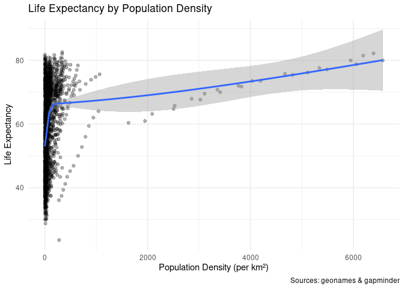
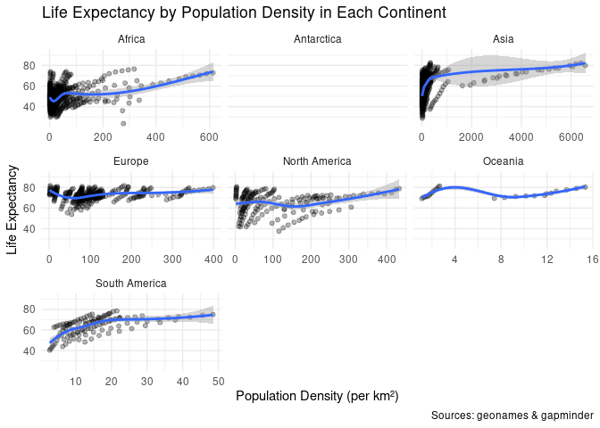

Part 1: Exploring the gapminder data
================
Eva Wu

-   [Load, merge, and tidy the data](#load-merge-and-tidy-the-data)
-   [Plot the data](#plot-the-data)
-   [Session info](#session-info)

## Load, merge, and tidy the data

In this section, we loaded the geonames data from the web, used
countrycode() to find the respective iso3 code for each country, merged
the geonames and gapminder data frames, calculated the population
density using population divided by area, and selected the columns of
interest.

    ## Rows: 1,812
    ## Columns: 4
    ## $ iso3c         <chr> "AND", "ARE", "AFG", "AFG", "AFG", "AFG", "AFG", "AFG", …
    ## $ continentName <chr> "Europe", "Asia", "Asia", "Asia", "Asia", "Asia", "Asia"…
    ## $ pop_density   <dbl> NA, NA, 13.01210, 14.27171, 15.85650, 17.81925, 20.19994…
    ## $ lifeExp       <dbl> NA, NA, 28.801, 30.332, 31.997, 34.020, 36.088, 38.438, …

## Plot the data

<!-- -->

This plot shows the relationship between life expectancy and population
density among all countries in the world. We cannot conclude that there
is a significant positive correlation between the two variables just
from this graph, but there is an overall trend that as population
density increases, life expectancy increases as well. More specifically,
when the population density is under 500, there is a sharp increase in
life expectancy as population density increases. However, when
population density is greater than 500, the line becomes flatter - life
expectancy does not change much as population density increases.

<!-- -->

Here we explored the relationship between life expectancy and population
density in different continents. As shown in the graph, we can see that
in Asia, Africa, and South America, there is a positive correlation
between the two variables. The greater population density, the longer
life expectancy. However, in Europe, North America, and Oceania, life
expectancy stays fairly constant across different population densities.
There is not enough data in Antarctica to create a graph, since there is
only an extremely small population on that continent.

# Session info

    ## ─ Session info ───────────────────────────────────────────────────────────────
    ##  setting  value                               
    ##  version  R version 4.0.1 (2020-06-06)        
    ##  os       Red Hat Enterprise Linux 8.4 (Ootpa)
    ##  system   x86_64, linux-gnu                   
    ##  ui       X11                                 
    ##  language (EN)                                
    ##  collate  en_US.UTF-8                         
    ##  ctype    en_US.UTF-8                         
    ##  tz       America/Chicago                     
    ##  date     2021-11-29                          
    ## 
    ## ─ Packages ───────────────────────────────────────────────────────────────────
    ##  package     * version date       lib source        
    ##  assertthat    0.2.1   2019-03-21 [2] CRAN (R 4.0.1)
    ##  backports     1.2.1   2020-12-09 [2] CRAN (R 4.0.1)
    ##  broom         0.7.9   2021-07-27 [2] CRAN (R 4.0.1)
    ##  cachem        1.0.5   2021-05-15 [2] CRAN (R 4.0.1)
    ##  callr         3.7.0   2021-04-20 [2] CRAN (R 4.0.1)
    ##  cellranger    1.1.0   2016-07-27 [2] CRAN (R 4.0.1)
    ##  cli           3.0.1   2021-07-17 [2] CRAN (R 4.0.1)
    ##  colorspace    2.0-2   2021-06-24 [2] CRAN (R 4.0.1)
    ##  countrycode * 1.3.0   2021-07-15 [2] CRAN (R 4.0.1)
    ##  crayon        1.4.1   2021-02-08 [2] CRAN (R 4.0.1)
    ##  DBI           1.1.1   2021-01-15 [2] CRAN (R 4.0.1)
    ##  dbplyr        2.1.1   2021-04-06 [2] CRAN (R 4.0.1)
    ##  desc          1.3.0   2021-03-05 [2] CRAN (R 4.0.1)
    ##  devtools      2.4.2   2021-06-07 [2] CRAN (R 4.0.1)
    ##  digest        0.6.27  2020-10-24 [2] CRAN (R 4.0.1)
    ##  dplyr       * 1.0.7   2021-06-18 [2] CRAN (R 4.0.1)
    ##  ellipsis      0.3.2   2021-04-29 [2] CRAN (R 4.0.1)
    ##  evaluate      0.14    2019-05-28 [2] CRAN (R 4.0.1)
    ##  fansi         0.5.0   2021-05-25 [2] CRAN (R 4.0.1)
    ##  farver        2.1.0   2021-02-28 [2] CRAN (R 4.0.1)
    ##  fastmap       1.1.0   2021-01-25 [2] CRAN (R 4.0.1)
    ##  forcats     * 0.5.1   2021-01-27 [2] CRAN (R 4.0.1)
    ##  fs            1.5.0   2020-07-31 [2] CRAN (R 4.0.1)
    ##  gapminder   * 0.3.0   2017-10-31 [2] CRAN (R 4.0.1)
    ##  generics      0.1.0   2020-10-31 [2] CRAN (R 4.0.1)
    ##  geonames    * 0.999   2019-02-19 [2] CRAN (R 4.0.1)
    ##  ggplot2     * 3.3.5   2021-06-25 [2] CRAN (R 4.0.1)
    ##  glue          1.4.2   2020-08-27 [2] CRAN (R 4.0.1)
    ##  gtable        0.3.0   2019-03-25 [2] CRAN (R 4.0.1)
    ##  haven         2.4.3   2021-08-04 [2] CRAN (R 4.0.1)
    ##  highr         0.9     2021-04-16 [2] CRAN (R 4.0.1)
    ##  hms           1.1.0   2021-05-17 [2] CRAN (R 4.0.1)
    ##  htmltools     0.5.2   2021-08-25 [2] CRAN (R 4.0.1)
    ##  httr          1.4.2   2020-07-20 [2] CRAN (R 4.0.1)
    ##  jsonlite      1.7.2   2020-12-09 [2] CRAN (R 4.0.1)
    ##  knitr         1.36    2021-09-29 [2] CRAN (R 4.0.1)
    ##  labeling      0.4.2   2020-10-20 [2] CRAN (R 4.0.1)
    ##  lattice       0.20-41 2020-04-02 [2] CRAN (R 4.0.1)
    ##  lifecycle     1.0.0   2021-02-15 [2] CRAN (R 4.0.1)
    ##  lubridate     1.7.10  2021-02-26 [2] CRAN (R 4.0.1)
    ##  magrittr      2.0.1   2020-11-17 [2] CRAN (R 4.0.1)
    ##  Matrix        1.2-18  2019-11-27 [2] CRAN (R 4.0.1)
    ##  memoise       2.0.0   2021-01-26 [2] CRAN (R 4.0.1)
    ##  mgcv          1.8-31  2019-11-09 [2] CRAN (R 4.0.1)
    ##  modelr        0.1.8   2020-05-19 [2] CRAN (R 4.0.1)
    ##  munsell       0.5.0   2018-06-12 [2] CRAN (R 4.0.1)
    ##  nlme          3.1-148 2020-05-24 [2] CRAN (R 4.0.1)
    ##  pillar        1.6.2   2021-07-29 [2] CRAN (R 4.0.1)
    ##  pkgbuild      1.2.0   2020-12-15 [2] CRAN (R 4.0.1)
    ##  pkgconfig     2.0.3   2019-09-22 [2] CRAN (R 4.0.1)
    ##  pkgload       1.2.1   2021-04-06 [2] CRAN (R 4.0.1)
    ##  prettyunits   1.1.1   2020-01-24 [2] CRAN (R 4.0.1)
    ##  processx      3.5.2   2021-04-30 [2] CRAN (R 4.0.1)
    ##  ps            1.6.0   2021-02-28 [2] CRAN (R 4.0.1)
    ##  purrr       * 0.3.4   2020-04-17 [2] CRAN (R 4.0.1)
    ##  R6            2.5.0   2020-10-28 [2] CRAN (R 4.0.1)
    ##  Rcpp          1.0.7   2021-07-07 [2] CRAN (R 4.0.1)
    ##  readr       * 2.0.1   2021-08-10 [2] CRAN (R 4.0.1)
    ##  readxl        1.3.1   2019-03-13 [2] CRAN (R 4.0.1)
    ##  remotes       2.4.0   2021-06-02 [2] CRAN (R 4.0.1)
    ##  reprex        2.0.1   2021-08-05 [1] CRAN (R 4.0.1)
    ##  rjson         0.2.20  2018-06-08 [2] CRAN (R 4.0.1)
    ##  rlang         0.4.11  2021-04-30 [2] CRAN (R 4.0.1)
    ##  rmarkdown     2.11    2021-09-14 [2] CRAN (R 4.0.1)
    ##  rprojroot     2.0.2   2020-11-15 [2] CRAN (R 4.0.1)
    ##  rstudioapi    0.13    2020-11-12 [2] CRAN (R 4.0.1)
    ##  rvest         1.0.1   2021-07-26 [2] CRAN (R 4.0.1)
    ##  scales        1.1.1   2020-05-11 [2] CRAN (R 4.0.1)
    ##  sessioninfo   1.1.1   2018-11-05 [2] CRAN (R 4.0.1)
    ##  stringi       1.7.4   2021-08-25 [2] CRAN (R 4.0.1)
    ##  stringr     * 1.4.0   2019-02-10 [2] CRAN (R 4.0.1)
    ##  testthat      3.0.4   2021-07-01 [2] CRAN (R 4.0.1)
    ##  tibble      * 3.1.3   2021-07-23 [2] CRAN (R 4.0.1)
    ##  tidyr       * 1.1.3   2021-03-03 [2] CRAN (R 4.0.1)
    ##  tidyselect    1.1.1   2021-04-30 [2] CRAN (R 4.0.1)
    ##  tidyverse   * 1.3.1   2021-04-15 [2] CRAN (R 4.0.1)
    ##  tzdb          0.1.2   2021-07-20 [2] CRAN (R 4.0.1)
    ##  usethis       2.0.1   2021-02-10 [2] CRAN (R 4.0.1)
    ##  utf8          1.2.2   2021-07-24 [2] CRAN (R 4.0.1)
    ##  vctrs         0.3.8   2021-04-29 [2] CRAN (R 4.0.1)
    ##  withr         2.4.2   2021-04-18 [2] CRAN (R 4.0.1)
    ##  xfun          0.25    2021-08-06 [2] CRAN (R 4.0.1)
    ##  xml2          1.3.2   2020-04-23 [2] CRAN (R 4.0.1)
    ##  yaml          2.2.1   2020-02-01 [2] CRAN (R 4.0.1)
    ## 
    ## [1] /home/wux21/R/x86_64-pc-linux-gnu-library/4.0
    ## [2] /opt/R/4.0.1/lib/R/library
